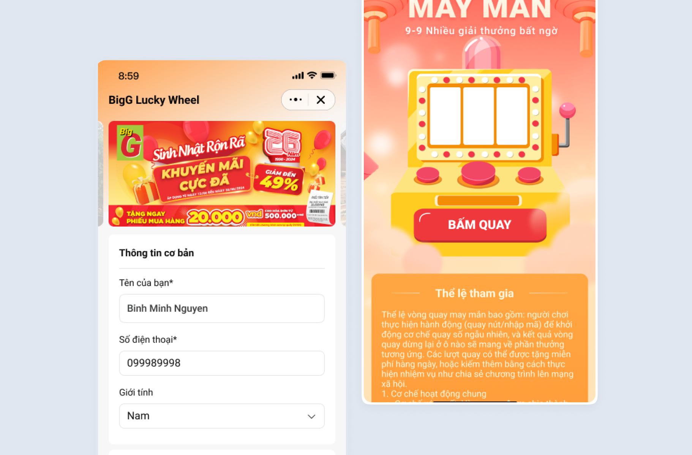
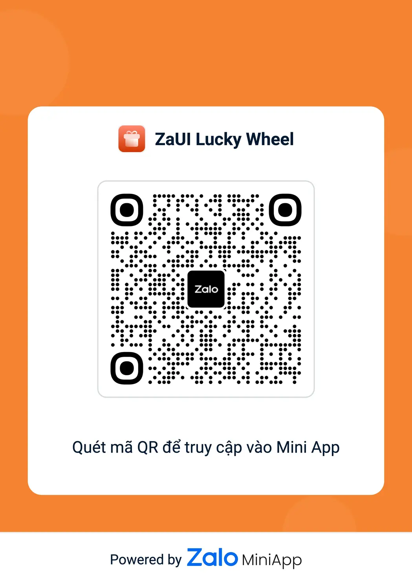

# ZaUI Lucky Wheel

ZaUI Lucky Wheel là bộ giao diện mẫu (Template) giúp xây dựng các chiến dịch Vòng quay may mắn (Lucky Wheel/Slot Machine) trên Zalo Mini App nhằm thu hút người dùng và tăng tương tác.

Template này tích hợp sẵn các luồng nghiệp vụ quan trọng: Landing page giới thiệu, Form đăng ký thông tin (có xác thực), Game vòng quay trúng thưởng và Màn hình nhận Voucher kèm tính năng quan tâm OA.

# Demo



# Figma

- Link Figma: https://www.figma.com/design/Byuy8djfHcsnxousDMFSqL/-Public--Zalo-Mini-App-Templates?node-id=9-22903

# QR Code

<div style="display: flex; justify-content: center;">
  
</div>

## Tính năng chính

- **Landing & Form đăng ký**: Banner sự kiện, hiệu ứng nền và form đăng ký nhanh sử dụng thư viện validation hiện đại.
- **Xin quyền & Tự động điền (Prefill)**: Luồng xin quyền truy cập thông tin/số điện thoại để tự động điền vào form, tăng tỷ lệ chuyển đổi.
- **Vòng quay may mắn (Slot Machine)**: Hiệu ứng quay thưởng mượt mà (Slot machine animation), dễ dàng tích hợp kết quả từ API.
- **Trả thưởng & Retargeting**: Màn hình hiện kết quả Voucher tích hợp Widget quan tâm OA để gửi thông báo sau này.

## Tech stack

<p style="display: flex; flex-wrap: wrap; gap: 4px;">
  
  
  
  
  
  
  
  
</p>

Dự án sử dụng các công nghệ mới nhất:

- **Core**: React, ZMP SDK, ZMP UI.
- **Form & Validation**: TanStack React Form kết hợp Valibot (Siêu nhẹ & Type-safe).
- **State Management**: Zustand.
- **Styling**: TailwindCSS.
- **Build Tool**: Vite 5.x.

## Hướng dẫn cài đặt và sử dụng

### Sử dụng Zalo Mini App Extension

1. Cài đặt [Visual Studio Code](https://code.visualstudio.com/download) và [Zalo Mini App Extension](https://miniapp.zaloplatforms.com/documents/devtools).
2. Nhấp vào **Create Project** > Chọn template **ZaUI Lucky Wheel** > Đợi khởi tạo dự án.
3. Cấu hình **App ID** và **Install Dependencies**, sau đó vào bảng **Run** > chọn **Start** để bắt đầu phát triển 🚀

### Sử dụng Zalo Mini App CLI

1. [Cài đặt Node JS](https://nodejs.org/en/download/).
2. [Cài đặt Mini App DevTools CLI](https://miniapp.zaloplatforms.com/documents/devtools/cli/intro/).
3. Tải xuống hoặc clone repository này.
4. Cài đặt thư viện:
   ```bash
   npm install
   ```
5. Chạy dev server:
   ```bash
   zmp start
   ```
6. Mở `localhost:3000` trên trình duyệt 🔥

## Triển khai (Deployment)

1. Tạo Mini App ID mới (Tham khảo [Hướng dẫn tạo Mini App](https://miniapp.zaloplatforms.com/documents/tutorial/coffee-shop)).
2. Triển khai code lên Zalo bằng ID vừa tạo.

   Nếu dùng `zmp-cli`:

   ```bash
   zmp login
   zmp deploy
   ```

3. Quét mã QR bằng Zalo để xem trước phiên bản đã deploy.

## Cấu trúc & Tùy biến (Usage)

Template này cung cấp sẵn UI và logic mẫu cho chiến dịch. Bạn cần kết nối với API nội bộ (Internal API) để xử lý logic quay thưởng, danh sách quà tặng và lưu trữ dữ liệu CRM.

**Các luồng chính:**

- **`src/pages/home.tsx`**: Trang chủ (Landing page) với banner, yêu cầu quyền truy cập và Form đăng ký (dùng TanStack Form + Valibot).
- **`src/pages/reward.tsx`**: Màn hình thông báo nhận lượt quay sau khi đăng ký thành công.
- **`src/pages/wheel.tsx`**: Màn hình vòng quay. Logic hiển thị và `slot-machine.tsx` nằm ở đây.
- **`src/pages/voucher.tsx`**: Màn hình kết quả trúng thưởng + Widget quan tâm OA (`showOAWidget`).
- **`src/services`**: Các hàm tiện ích để xin quyền và lấy thông tin User/SĐT từ Zalo.
- **`stores`**: Quản lý state xin quyền và thông tin user bằng Zustand.
- **`schemas`**: Chứa file `register.schema.ts` định nghĩa luật validation cho form.

**Cấu trúc thư mục:**

- **`src`**: Mã nguồn chính.
  - **`components`**: Các UI block tái sử dụng (background, register form, slot machine, voucher card).
  - **`pages`**: Các màn hình chính.
  - **`services`**: Helper gọi Zalo API.
  - **`stores`**: Zustand store.
  - **`schemas`**: Valibot schemas.
  - **`static`**: Hình ảnh và tài nguyên cho vòng quay (Assets).
  - **`utils`**: Hàm tiện ích (Tailwind merge...).
  - **`app.tsx`, `router.tsx`**: App shell và định tuyến.

- **`app-config.json`**: [Cấu hình Zalo Mini App](https://miniapp.zaloplatforms.com/documents/intro/getting-started/app-config/).

## Hướng dẫn tích hợp (Recipes)

### 1. Thay đổi thương hiệu (Branding)

Thay đổi màu sắc và typography trong file `src/tokens.ts`. Tailwind sẽ tự động kế thừa các giá trị này để áp dụng cho toàn bộ ứng dụng.

### 2. Tùy chỉnh Form & Validation

Để thay đổi các trường đăng ký hoặc luật kiểm tra dữ liệu, hãy sửa file `src/schemas/register.schema.ts` và các giá trị mặc định trong `src/components/register-form.tsx`.

### 3. Kết nối API Quay thưởng (Spin Logic)

Hiện tại vòng quay đang trả về kết quả ngẫu nhiên (Random). Để kết nối với Backend:

1. Mở file `src/components/slot-machine.tsx`.
2. Tìm hàm `spin()`.
3. Thay thế đoạn code random bằng lệnh gọi API của bạn để lấy kết quả trúng thưởng từ server, sau đó map kết quả đó vào các biểu tượng (symbols) trên vòng quay.

### 4. Thay đổi tài nguyên (Assets)

Thay thế các hình ảnh nền, vòng quay, voucher trong thư mục `src/static`. Lưu ý điều chỉnh lại CSS class nếu kích thước ảnh mới khác biệt quá nhiều.

## Design Disclaimer

**Lưu ý:**

- Nội dung thiết kế, hình ảnh minh họa và ví dụ trong bài viết này chỉ mang tính chất tham khảo nhằm phục vụ mục đích nghiên cứu, minh họa và thử nghiệm.

- Zalo Group không chịu trách nhiệm cho bất kỳ việc sử dụng, triển khai hoặc diễn giải nào phát sinh từ nội dung này trong môi trường thực tế hoặc thương mại.

## License

Copyright (c) Zalo Group and its affiliates. All rights reserved.

The examples provided by Zalo Group are for non-commercial testing and evaluation
purposes only. Zalo Group reserves all rights not expressly granted.
